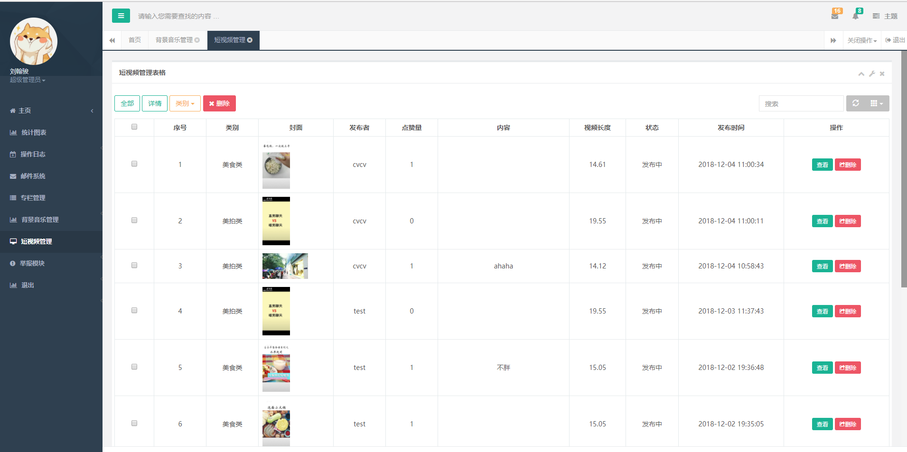
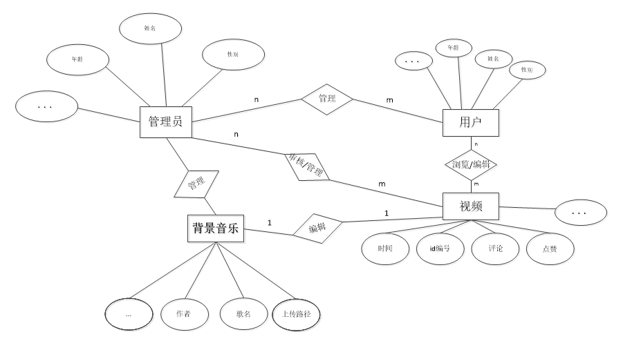
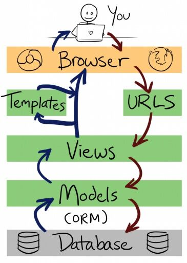
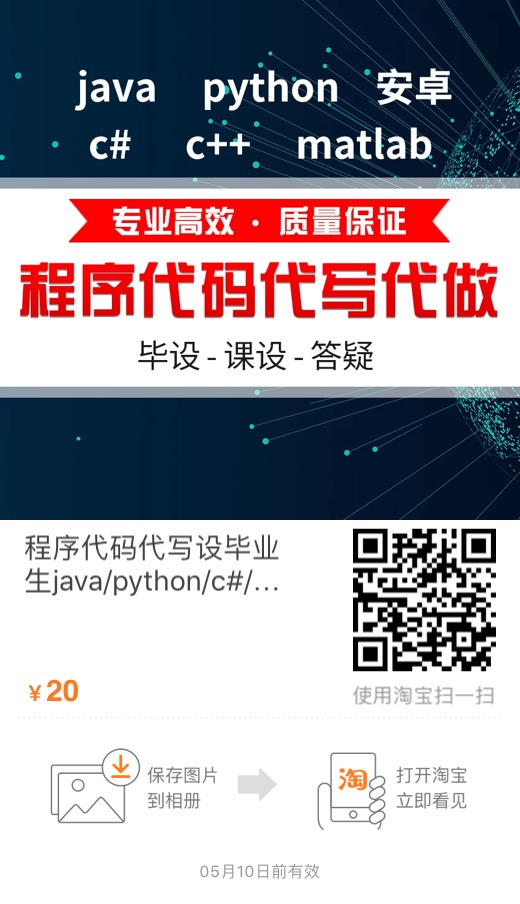

# 秀视频--小程序社交软件
#
<h2>线上版</h2>

<blockquote>
简介：简介随着微信的普及，小视频的流行，我们设计一款基于微信小程序端的视频社交软件 + 后台管理系统作为自己专科毕业设计----秀视频-微信小程序端（短视频社交小程序，用户可以在小程序上发布自己的短视频 并且经过我们的平台加入滤镜或者背景音乐制作出独具特色的短视频。并实现了点赞、评论、下载、分享、转发等功能的小程序）---的后台管理系统，主要实现了人员的管理，短视频的管理，背景音乐的管理，登陆注册，权限验证，单点登陆等等。 从需求分析，功能设计，前端到后台，再到数据库的设计。一点点的积累，一点点的完善，预计小程序端+后台管理系统开发周期一个月(每天更新)。 对一个开发人员来说，如果想单纯的做出这些功能，其实并不难。 难的是对于这些功能细节的把控，项目整体的友好程度，用户的体验效果；对并发的考虑，对恶意请求，对流畅度这些细节的考虑等等。
</blockquote>

<blockquote>
Introduction: The background management system as its own specialized graduation project - Show Video - Wechat Small Program (Short Video Social Program), users can publish their own short videos on the small program and produce their own short videos through our filter background music, and realize the functions of praise, comment, sharing, forwarding and so on. The background management system mainly realizes personnel management, short video management, background music management, login registration, authority verification, single-point login and so on. From requirement analysis, function design, front-end to back-end, and then to database design. A little accumulation, a little improvement, the expected small program side + background management system development cycle for a month (updated daily). For a developer, it is not difficult to do these functions simply. It is difficult to control the details of these functions, the overall friendliness of the project, the user experience effect, the consideration of concurrency, malicious requests, the consideration of fluency and so on.
</blockquote>
# 

<h2>前台-小程序端效果展示</h2>

 
<h2>后台管理系统页面展现</h2>

<h2>关键字：springboot、分布式、前后分离</h2>

<h2>相关技术 </h2>
 
前端:h5+css+javascript+jquery+bootstrap+themeleaf+ H plus

 
后端:springcloud+springboot+sping+springmvc+mybatis+mysql+redis+shiro

 
组件:bootsrap-table,webUploader,pagehelper+layer

 
项目部署: docker + linux

 
中间件:eureka(微服务治理)

 
消息队列: rabbitmq

 
测试:swagger2

 
开发风格：分布式系统架构，前后分离开发风格，RESTful api

<h2>代码介绍 </h2>

scetc-show-videos-admin 后台管理系统

scetc-show-videos-cloud eureka服务发现与注册

scetc-show-videos-config 分布式配置中心

scetc-show-videos-dev 小程序后台

scetc-show-videos-page 小程序界面

 <h2>需求分析</h2>
 
用户需求
 
 
用户个人信息管理，视频的编辑（加入滤镜或者背景音乐）、上传、浏览、点赞、关注、下载、等功能。

 
管理员需求

 
毕业设计选题环节中，系统管理员的需求为：用户管理（新增用户、删除用户及用户登录系统数据的初始化操作）、视频管理（视频分类、新增视频、对违违法视频进行删除操作）、背景音乐管理（对音乐库中音乐的增删改查）、滤镜管理（滤镜的增改）、用户管理（新增各权限级的管理员、删除管理员、对子集权限组管理员系统登录数据的初始化操作）以及消息通知（发布不同对象的系统消息、对所有消息进行查看及删除操作）
 
 

  
<h2>项目设计</h2>
<h2>2.1 微信小程序端</h2>

前台的设计、后台的管理、安全性

前端：基于微信小程序的开发文档

后端：基于springboot微服务架构   +   mysql数据库  +  redis缓存数据库  +  ffmpeg

组件：wxsearch微信小程序搜索组件

音视频工程工具+mybatis 数据持久层框架+redis数据库

<h2>2.2 后台管理系统端</h2>

后台管理系统的开发、安全性

mybatis 数据持久层框架+redis数据库

网站前端：bootstrap前端框架 + javascript + css +html +jquery +ajax+themeleaf模板引擎 

短视频：审核、删除

背景音乐：添加和修改

管理员管理：用户管理、视频访问量、点击率的记载分析

 
<h2>3.模块设计</h2>

3.1.1 用户端模块

用户模块主要页面有个人管理、视频编辑、管理、上传、浏览、下载等

3.1.3 管理员模块

管理员模块主要页面有个人管理、人员管理、视频管理、音乐管理、审核发布、用户列表管理。

<h2>3.2 界面设计</h2>

3.2.1 用户页面

学生界面设计布局为横向栏导航、面包屑导航及页面内容构成，横向栏导航条鼠标悬浮其背景将变色，选中栏目的背景色异于未选中背景色，面包屑导航当前栏目不可操作，可直接回值

父级栏目，页面可实现响应式布局，如图所示，为用户成功登录后页面。

<h2>3.3 数据库设计</h2>

3.3.1 数据库实体关系图

<h2>4. 框架设计</h2>

   
<h2>如何快速导入项目?</h2>

将scetc-show-videos-page小程序页面导入到微信开发工具栏中即可

如需使用本地api需要部署scetc-show-videos-dev项目（项目以war包发布，需要额外配置tomcat环境）,并且在app.json文件中修改serverUr服务器地址

云服务器地址:https://www.lotcloudy.com/scetc-show-videos-mini-api-0.0.1-SNAPSHOT/

关于后台管理系统 导入scetc-show-videos-admin项目

关于分布式环境配置，观看相关的配置文件即可

 <h2>开发交流</h2>
 
开发交流群:673926093
</body>

该项目禁止未经过作者允许用于商业用途，仅作为交流学习为目的。

 <h2>作品荣耀</h2>
  
省计算机比赛二等奖

 
学院院计算机比赛一等奖

 
软件著作权

  
 
 
 <h2>技术栈</h2>
 <h2>后端</h2>
 <table>
<thead>
<tr>
<th>名称</th>
<th>描述</th>
<th>官网</th>
</tr>
</thead>
<tbody>
<tr>
<td>Spring Framework</td>
<td>容器</td>
<td><a href="http://projects.spring.io/spring-framework/" rel="nofollow">http://projects.spring.io/spring-framework/</a></td>
</tr>
<tr>
<td>SpringMVC</td>
<td>MVC框架</td>
<td><a href="http://docs.spring.io/spring/docs/current/spring-framework-reference/htmlsingle/#mvc" rel="nofollow">http://docs.spring.io/spring/docs/current/spring-framework-reference/htmlsingle/#mvc</a></td>
</tr>
<tr>
<td>MyBatis</td>
<td>ORM框架</td>
<td><a href="http://www.mybatis.org/mybatis-3/zh/index.html" rel="nofollow">http://www.mybatis.org/mybatis-3/zh/index.html</a></td>
</tr>
<tr>
<td>MyBatis Generator</td>
<td>代码生成</td>
<td><a href="http://www.mybatis.org/generator/index.html" rel="nofollow">http://www.mybatis.org/generator/index.html</a></td>
</tr>
<tr>
<td>Apache Shiro</td>
<td>安全框架</td>
<td><a href="http://shiro.apache.org/" rel="nofollow">http://shiro.apache.org/</a></td>
</tr>
<tr>
<td>PageHelper</td>
<td>MyBatis分页</td>
<td><a href="http://git.oschina.net/free/Mybatis_PageHelper" rel="nofollow">http://git.oschina.net/free/Mybatis_PageHelper</a></td>
</tr>
<tr>
<td>Maven</td>
<td>项目构建管理</td>
<td><a href="http://maven.apache.org/" rel="nofollow">http://maven.apache.org/</a></td>
</tr>
<tr>
<td>MySQL</td>
<td>数据库</td>
<td><a href="https://www.mysql.com/" rel="nofollow">https://www.mysql.com/</a></td>
</tr>
<tr>
<td>Tomcat 8.0</td>
<td>服务器</td>
<td><a href="http://tomcat.apache.org/" rel="nofollow">http://tomcat.apache.org/</a></td>
</tr>
</tbody>
</table>
 
<h2>前端</h2>
<table>
<thead>
<tr>
<th>名称</th>
<th>描述</th>
<th>官网</th>
</tr>
</thead>
<tbody>
<tr>
<td>jQuery</td>
<td>函数库</td>
<td><a href="http://jquery.com/" rel="nofollow">http://jquery.com/</a></td>
</tr>
<tr>
<td>Bootstrap</td>
<td>前端框架</td>
<td><a href="http://getbootstrap.com/" rel="nofollow">http://getbootstrap.com/</a></td>
</tr>
<tr>
<td>Bootstrap-table</td>
<td>数据表格</td>
<td><a href="http://bootstrap-table.wenzhixin.net.cn/" rel="nofollow">http://bootstrap-table.wenzhixin.net.cn/</a></td>
</tr>
<tr>
<td>echarts</td>
<td>图表</td>
<td><a href="http://echarts.baidu.com/" rel="nofollow">http://echarts.baidu.com/</a></td>
</tr>
<tr>
<td>web uploader</td>
<td>图片上传</td>
<td><a href="http://fex.baidu.com/webuploader/" rel="nofollow">http://fex.baidu.com/webuploader/</a></td>
</tr>
<tr>
<td>layui</td>
<td>弹出层</td>
<td><a href="http://www.layui.com/" rel="nofollow">http://www.layui.com/</a></td>
</tr>
<tr>
<td>sweetalert</td>
<td>弹出层</td>
<td><a href="http://mishengqiang.com/sweetalert/" rel="nofollow">http://mishengqiang.com/sweetalert/</a></td>
</tr>
<tr>
<td>highlight</td>
<td>代码高亮</td>
<td><a href="https://highlightjs.org/" rel="nofollow">https://highlightjs.org/</a></td>
</tr>
<tr>
<td>summernote</td>
<td>富文本编辑</td>
<td><a href="https://summernote.org/" rel="nofollow">https://summernote.org/</a></td>
</tr>
<tr>
<td>pace</td>
<td>进度条</td>
<td><a href="https://github.hubspot.com/pace/" rel="nofollow">https://github.hubspot.com/pace/</a></td>
</tr>

<tr>
<td>fakeLoader</td>
<td>页面预加载</td>
<td><a href="https://www.awesomes.cn/repo/joaopereirawd/fakeloader-js" rel="nofollow">https://www.awesomes.cn/repo/joaopereirawd/fakeloader-js</a></td>
</tr>
</tr>
</tbody>
</table>
 

<h2>写在最后的话</h2>
借鉴或参考请先联系作者(986771570@qq.com)，
欢迎Star或Fork，
您的star和Fork是对作品的认同与肯定，感谢！
<h2>小程序最终版</h2>

由于小程序需要办理各种资质，故放弃线上版本，如果需要安装小程序，导入page页面即可

<h2>关于我们的淘宝店？</h2>

我们团队服务程序代写多年，有许多精英程序员的加盟，如需定制一款自己的软件 欢迎联系我们！

