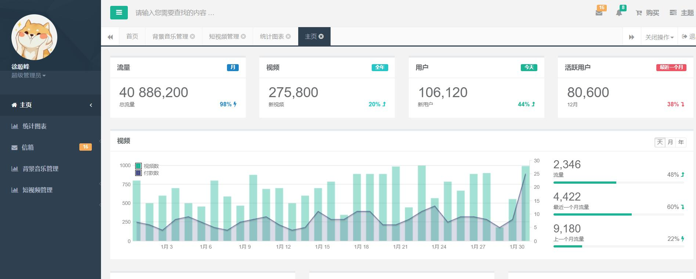
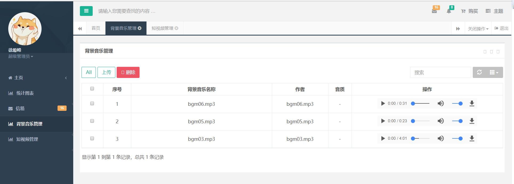
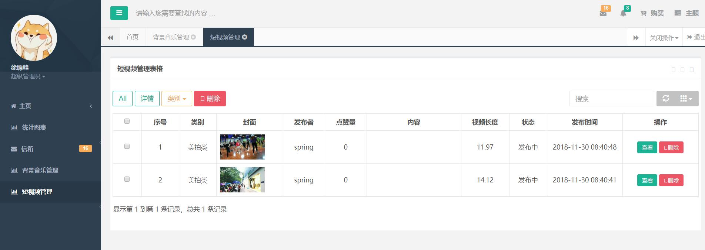

# 后台管理系统
# 相关技术 
 
前端:h5+css+javascript+jquery+bootstrap+themeleaf+H plus

 
后端:springboot+ sping+springmvc+mybatis+pagehelper+mysql+redis

 
组件:bootsrap-table,webUploader.

 
项目部署: docker + linux

 
项目相关:前后分离的开发模式，作为自己秀视频的平台的后台管理系统，同时作为自己专科的毕业设计秀视频的后台管理系统! 冲鸭 ！！！

 
页面展现:

1.

2.

3.

