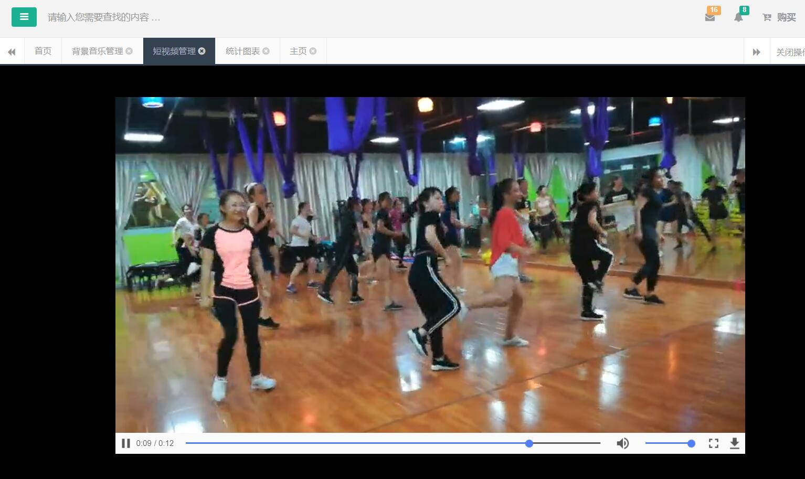
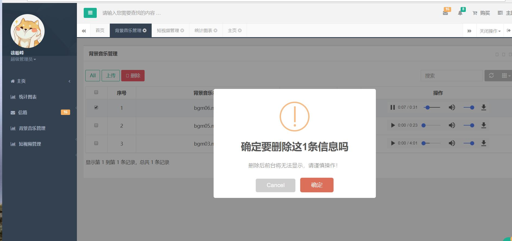

# 秀视频--后台管理系统
#
<blockquote>
简介：该后台管理系统作为自己专科毕业设计----秀视频-微信小程序端（短视频社交小程序，用户可以在小程序上发布自己的短视频 并且经过我们的滤镜 背景音乐制作出自己的短视频，
并实现了点赞、评论、分享、转发等功能的小程序）---的后台管理系统，主要实现了人员的管理，短视频的管理，背景音乐的管理，登陆注册，权限验证，单点登陆等等。
从需求分析，功能设计，前端到后台，再到数据库的设计。一点点的积累，一点点的完善，预计小程序端+后台管理系统开发周期一个月(每天更新)。
对一个开发人员来说，如果想单纯的做出这些功能，其实并不难。
难的是对于这些功能细节的把控，项目整体的友好程度，用户的体验效果；对并发的考虑，对恶意请求，对流畅度这些细节的考虑等等。 
</blockquote>

<blockquote>
Introduction: The background management system as its own specialized graduation project - Show Video - Wechat Small Program (Short Video Social Program), users can publish their own short videos on the small program and produce their own short videos through our filter background music, and realize the functions of praise, comment, sharing, forwarding and so on. The background management system mainly realizes personnel management, short video management, background music management, login registration, authority verification, single-point login and so on. From requirement analysis, function design, front-end to back-end, and then to database design. A little accumulation, a little improvement, the expected small program side + background management system development cycle for a month (updated daily). For a developer, it is not difficult to do these functions simply. It is difficult to control the details of these functions, the overall friendliness of the project, the user experience effect, the consideration of concurrency, malicious requests, the consideration of fluency and so on.
</blockquote>
# <h2>相关技术 </h2>
 
前端:h5+css+javascript+jquery+bootstrap+themeleaf+ H plus

 
后端:springboot+sping+springmvc+mybatis+mysql+redis+shiro

 
组件:bootsrap-table,webUploader,pagehelper

 
项目部署: docker + linux

 
中间件: zookeeper

 
测试:swagger2

 
开发风格：前后分离开发风格，restfull api

 
技术栈

  
 <h2>后端</h2>
 <table>
<thead>
<tr>
<th>名称</th>
<th>描述</th>
<th>官网</th>
</tr>
</thead>
<tbody>
<tr>
<td>Spring Framework</td>
<td>容器</td>
<td><a href="http://projects.spring.io/spring-framework/" rel="nofollow">http://projects.spring.io/spring-framework/</a></td>
</tr>
<tr>
<td>SpringMVC</td>
<td>MVC框架</td>
<td><a href="http://docs.spring.io/spring/docs/current/spring-framework-reference/htmlsingle/#mvc" rel="nofollow">http://docs.spring.io/spring/docs/current/spring-framework-reference/htmlsingle/#mvc</a></td>
</tr>
<tr>
<td>MyBatis</td>
<td>ORM框架</td>
<td><a href="http://www.mybatis.org/mybatis-3/zh/index.html" rel="nofollow">http://www.mybatis.org/mybatis-3/zh/index.html</a></td>
</tr>
<tr>
<td>MyBatis Generator</td>
<td>代码生成</td>
<td><a href="http://www.mybatis.org/generator/index.html" rel="nofollow">http://www.mybatis.org/generator/index.html</a></td>
</tr>
<tr>
<td>Apache Shiro</td>
<td>安全框架</td>
<td><a href="http://shiro.apache.org/" rel="nofollow">http://shiro.apache.org/</a></td>
</tr>
<tr>
<td>PageHelper</td>
<td>MyBatis分页</td>
<td><a href="http://git.oschina.net/free/Mybatis_PageHelper" rel="nofollow">http://git.oschina.net/free/Mybatis_PageHelper</a></td>
</tr>
<tr>
<td>Maven</td>
<td>项目构建管理</td>
<td><a href="http://maven.apache.org/" rel="nofollow">http://maven.apache.org/</a></td>
</tr>
<tr>
<td>MySQL</td>
<td>数据库</td>
<td><a href="https://www.mysql.com/" rel="nofollow">https://www.mysql.com/</a></td>
</tr>
<tr>
<td>Tomcat 8.0</td>
<td>服务器</td>
<td><a href="http://tomcat.apache.org/" rel="nofollow">http://tomcat.apache.org/</a></td>
</tr>
</tbody>
</table>

 
<h2>前端</h2>
<table>
<thead>
<tr>
<th>名称</th>
<th>描述</th>
<th>官网</th>
</tr>
</thead>
<tbody>
<tr>
<td>jQuery</td>
<td>函数库</td>
<td><a href="http://jquery.com/" rel="nofollow">http://jquery.com/</a></td>
</tr>
<tr>
<td>Bootstrap</td>
<td>前端框架</td>
<td><a href="http://getbootstrap.com/" rel="nofollow">http://getbootstrap.com/</a></td>
</tr>
<tr>
<td>Bootstrap-table</td>
<td>数据表格</td>
<td><a href="http://bootstrap-table.wenzhixin.net.cn/" rel="nofollow">http://bootstrap-table.wenzhixin.net.cn/</a></td>
</tr>
<tr>
<td>echarts</td>
<td>图表</td>
<td><a href="http://echarts.baidu.com/" rel="nofollow">http://echarts.baidu.com/</a></td>
</tr>
<tr>
<td>web uploader</td>
<td>图片上传</td>
<td><a href="http://fex.baidu.com/webuploader/" rel="nofollow">http://fex.baidu.com/webuploader/</a></td>
</tr>
<tr>
<td>layui</td>
<td>弹出层</td>
<td><a href="http://www.layui.com/" rel="nofollow">http://www.layui.com/</a></td>
</tr>
<tr>
<td>sweetalert</td>
<td>弹出层</td>
<td><a href="http://mishengqiang.com/sweetalert/" rel="nofollow">http://mishengqiang.com/sweetalert/</a></td>
</tr>
<tr>
<td>highlight</td>
<td>代码高亮</td>
<td><a href="https://highlightjs.org/" rel="nofollow">https://highlightjs.org/</a></td>
</tr>
<tr>
<td>summernote</td>
<td>富文本编辑</td>
<td><a href="https://summernote.org/" rel="nofollow">https://summernote.org/</a></td>
</tr>
<tr>
<td>pace</td>
<td>进度条</td>
<td><a href="https://github.hubspot.com/pace/" rel="nofollow">https://github.hubspot.com/pace/</a></td>
</tr>

<tr>
<td>fakeLoader</td>
<td>页面预加载</td>
<td><a href="https://www.awesomes.cn/repo/joaopereirawd/fakeloader-js" rel="nofollow">https://www.awesomes.cn/repo/joaopereirawd/fakeloader-js</a></td>
</tr>
</tr>
</tbody>
</table>
 
<h2>前台-小程序端(注意 源码部分为后台管理系统的代码 在这里只是展现小程序端的功能)</h2>

 
<h2>后台管理系统页面展现:</h2>
1.

2.

3.

4.

5.
 

开发交流群:673926093

